# Neural Network System for Tree Detection in Satellite Imagery

## 1. Introduction

This project was done as a bachelor thesis by Dainius Saltenis in Kaunas University of Technology, Software Systems program.

The project consists of (1) a Neural Network trained to detect instances of trees in satellite images, (2) a Windows app
 to interact with the model and (3) an API for model's deployment.

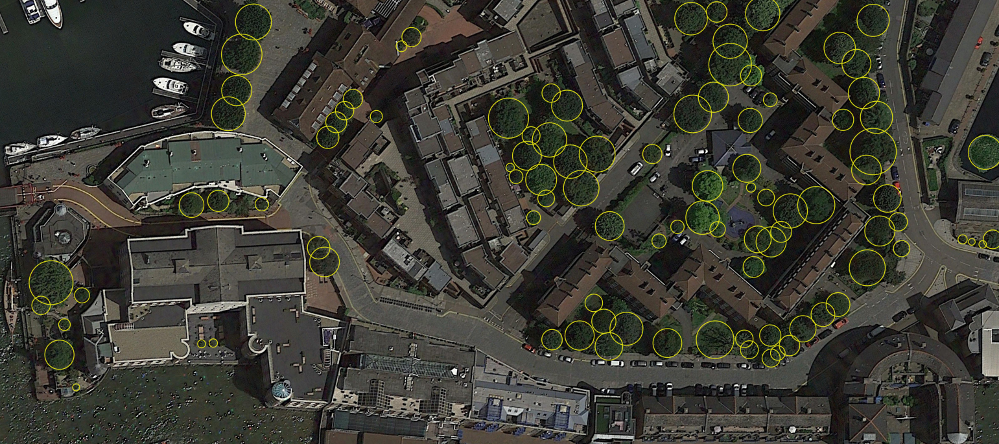
 
**Note**: the repository contains only the Deep Learning part of the project. Please see below for the visualizations of
 the usage examples via the Windows application.

## 2. Project

#### 2.1. Problem

Various problems that have to be solved manually could be automated with tree detection system:
* Automated detection of chopped-down trees in cities;
* Deforestation assessment;
* Damage assessment after natural disasters;
* Various kinds of urbanistic-oriented assessments.  

#### 2.2. Goal

Design a system that is capable of:
* Detecting trees from satellite images with reasonably good accuracy;
* Create a prototype of an interface to interact with the model deployed externally;
* Accept an image of any size & compute predictions quickly.
* Detect locations where a tree is no longer present in new images.

## 3. Model

#### 3.1. Architecture

##### 3.1.1. Detector

The detection model is based on [CenterNet](https://arxiv.org/pdf/1904.07850.pdf) object detector. The neural network is of a Feature 
Pyramid Network (FPN) architecture. For each point in its output space it (1) predicts confidence score of the presence
 of a class' object center in some region in an input image, (2) detected object's height and width, (3) an offset (confidence output dimensions are 4x lower than 
 input image size).  

##### 3.1.2. Backbone

In this project we test the detector with MobileNetV2, MobileNetV3, ResNet50 and EfficientNetB0 backbones. Small networks were purposely selected to account for 
small dataset size. Finally, a custom backbone was iteratively created that slightly improved the performance in 
comparison to the tested standard backbones.

FPN + Backbone architecture visualization:

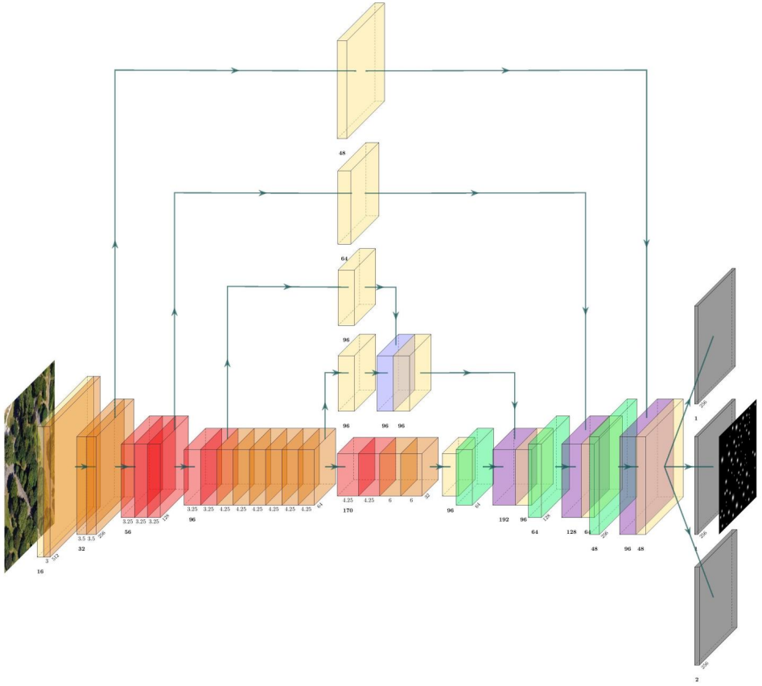

#### 3.2. Training 

Each backbone network was trained to achieve the best performance as was feasibly possible, hence different settings were
used for each model. L2 regularization was used only for ResNet50. Please see the code for augmentations and other 
details.

For a selected threshold, the final model achieves Recall of 0.666 and Precision of 0.642 at an average of 0.036 ms 
inference speed on my laptop GPU (input size 512x512). 

#### 3.3. Inference

At inference time, all images are cropped passed into the network at 512x512 size. Larger images are cropped into 
partially overlapping 512x512 patches, separately processed and an additional non-maximum suppression is computed for
all separate predictions on the original image coordinate space.

## 4. Visualizations

Below are visualizations of Windows app being used to compute predictions. Red circles mark tree locations where they were 
previously present based on past images of the same location:

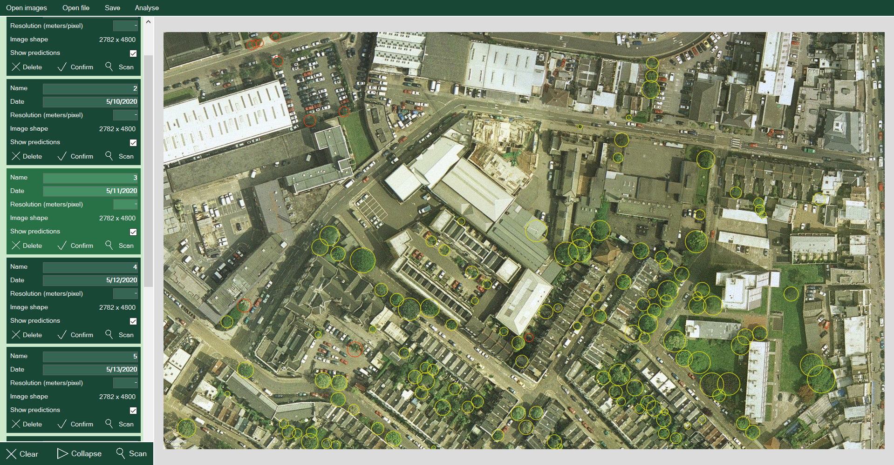

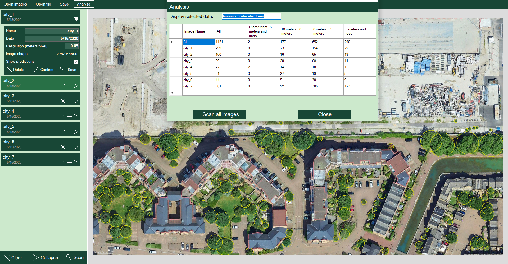

Some images together with their raw, unparsed predictions:

Input             |  Heatmap prediction
:-------------------------:|:-------------------------:
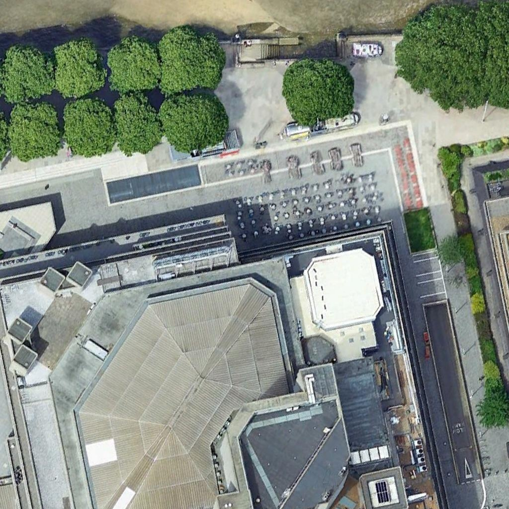  |  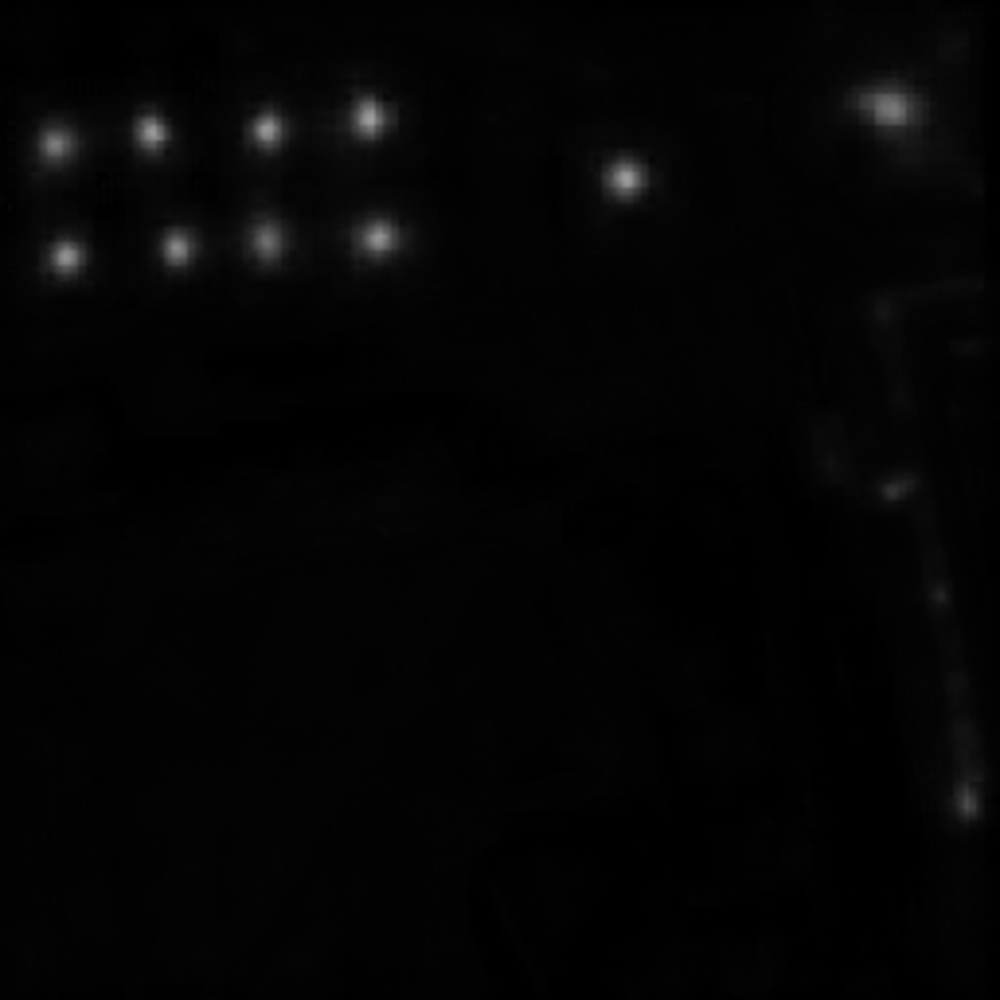
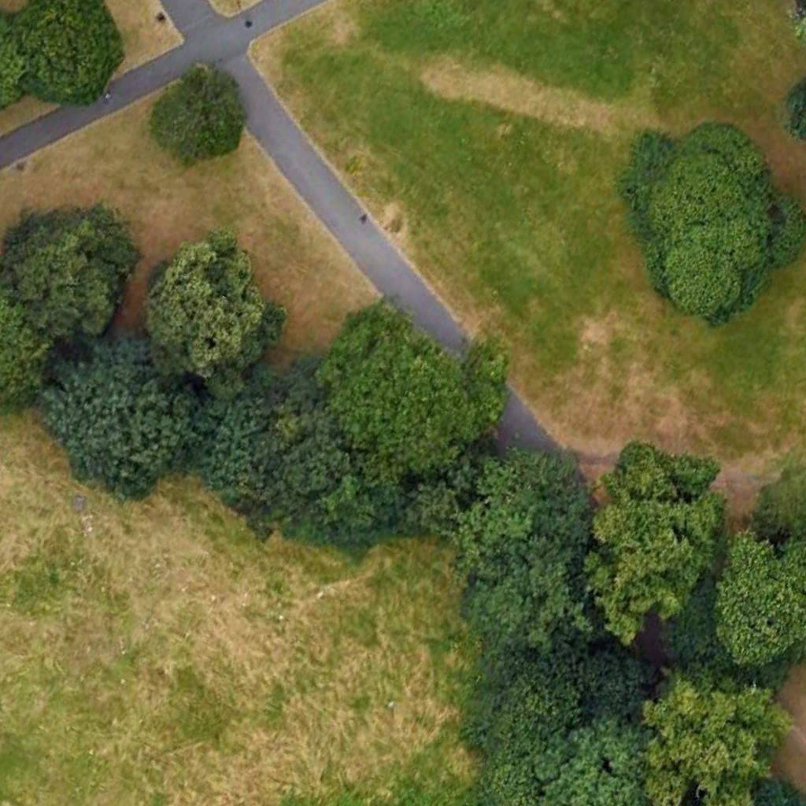  |  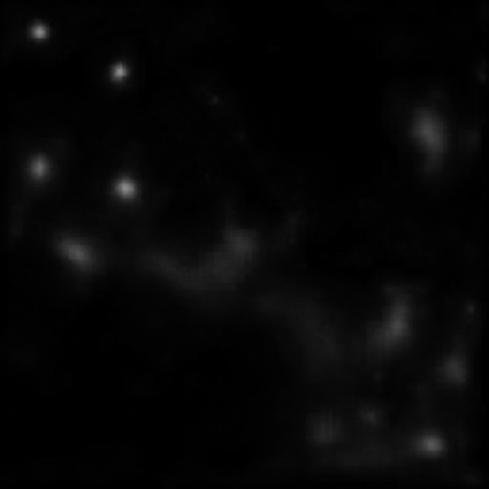
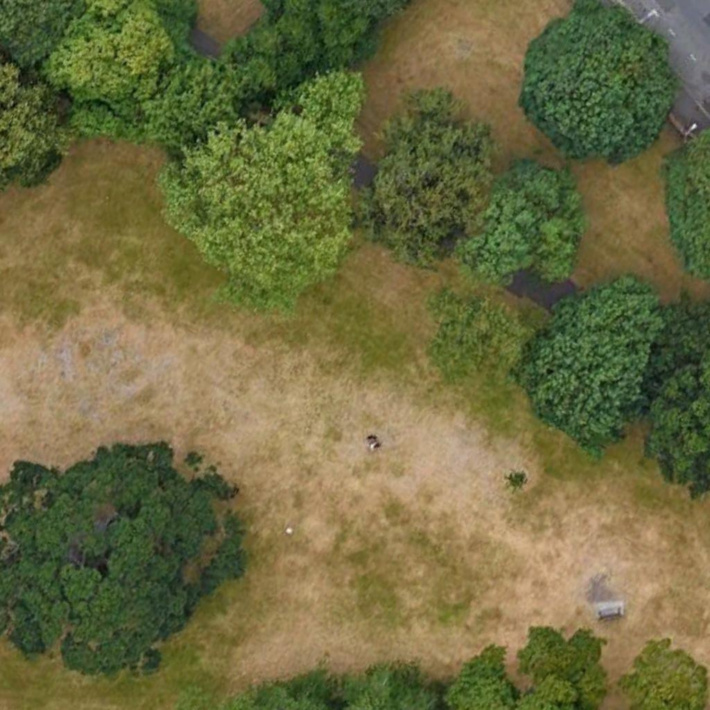  |  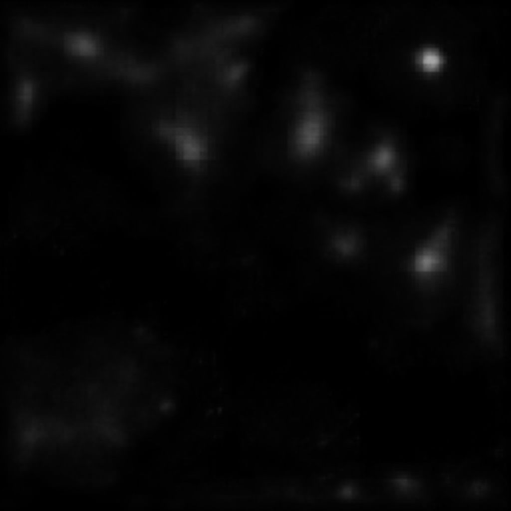

## 5. Project structure

#### 5.1. Repo code class diagram

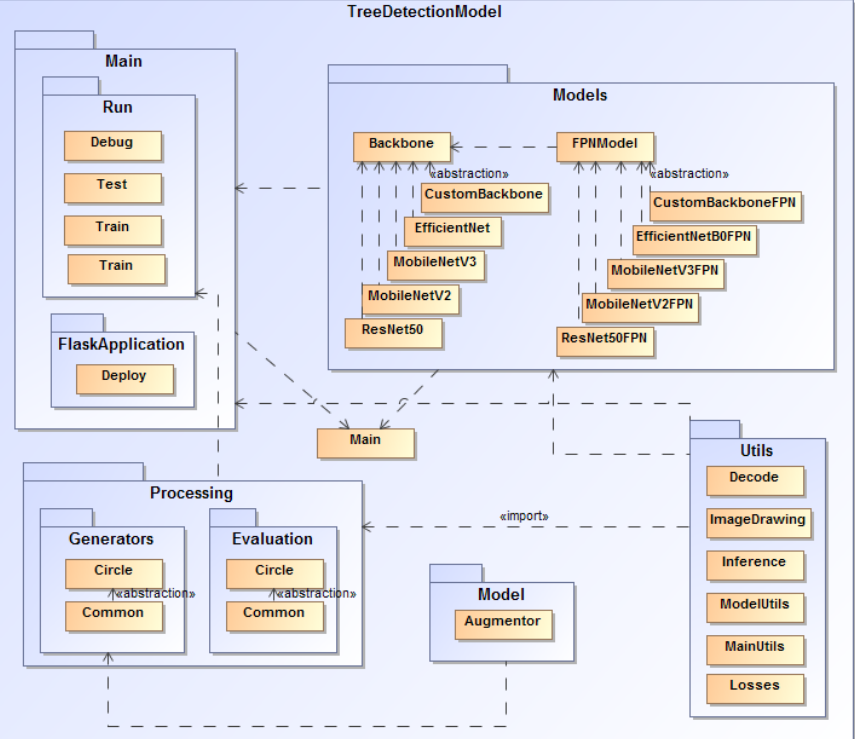

#### 5.2. Model-View-Controller architecture diagram

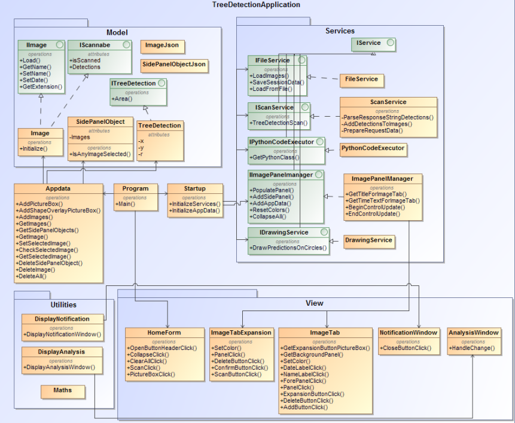

## Additional notes

- The full thesis paper is at ./resources/paper/thesis.pdf (written in Lithuanian language). 
- Tensorflow / Keras are used to implement the deep learning part of the pipeline.

